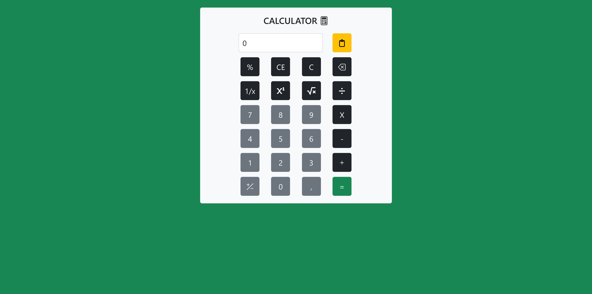

# 🧮 Calculator

## 📖 Description

The "Calculator" project is a simple web-based calculator built using HTML, CSS, and JavaScript. The application allows basic mathematical operations such as addition, subtraction, multiplication, and division, as well as additional functions like square roots, exponentiation, percentages, and changing the sign of a number.

🎯 **Project Goals:**

- Practice and learn the Bootstrap library 🎨
- Improve skills in using `querySelector` and `addEventListener` 🛠️

## 🚀 Technologies

- 🌐 HTML
- 🎨 CSS (Bootstrap)
- 📜 JavaScript (ES6)

## ✨ Features

- ➕➖✖️➗ Basic mathematical operations
- 📊 Percentage calculation
- 🔢 Exponentiation and square root
- 🔄 Changing the sign of a number
- ⏪ Deleting the last digit (backspace)
- 📋 Copying the result to the clipboard
- 🔄 Resetting the result

## 📂 Project Structure

```
calculator/
│── index.html   # Main calculator page
│── app.js       # Calculator logic
│── styles.css   # Styles (optional if not using Bootstrap)
```

## 🛠️ Installation & Usage

1. 📥 Download or clone the repository.
2. 🌍 Open the `index.html` file in a web browser.
3. ✅ The calculator is ready to use.

## 🖥️ How to Use

1. 🔢 Enter a number in the display field or use the calculator buttons.
2. ✨ Select the desired mathematical operation.
3. 🟰 Press `=` to see the result.
4. 🧹 Use `C` or `CE` to clear the values.
5. 📋 Click the clipboard icon to copy the result.

## 📸 Screenshots



## 👨‍💻 Author

Created by **Jarosław Baumgart**.

## 📜 License

This project is available under the **MIT License**.

## 📬 Contact

If you have any questions, feel free to reach out:

🔗 **GitHub:** [Jaroslaw-Baumgart](https://github.com/Jaroslaw-Baumgart)  
📧 **Email:** jaroslawbaumgart@gmail.com
